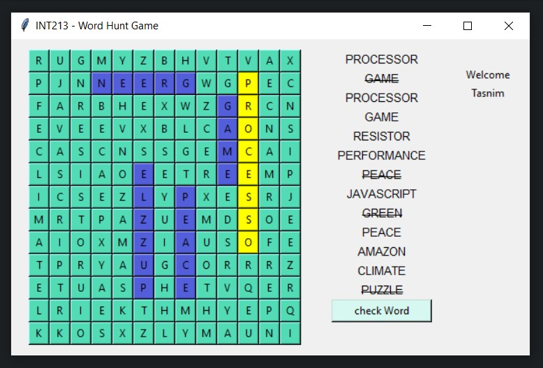

<p align="center">
    
    
    
    
    
</p>

# INT213 - Word Hunt Game

Let's hunt the lost words 🔍

## Language Used

<p align="center">
    
</p>

## Requirements

| Name   | Version | Website                                      |
| ------ | ------- | -------------------------------------------- |
| Python | ^3.9    | https://www.python.org/                      |
| Poetry | ^1.14   | https://python-poetry.org/docs/#installation |

## Getting Started

1. Clone (Download) the project

```bash
git clone https://github.com/tasnimzotder/int213-word-hunt-game.git
```

2. Run the program

a. Windows

```bash
./run.ps1
```

b. Linux

```bash
bash run.sh
```

## Collaborators

<p align="center">
    <a href="https://github.com/tasnimzotder">
        
        &nbsp&nbsp&nbsp&nbsp
    </a>
    <a href="https://github.com/Souvik-Ghosal">
        
        &nbsp&nbsp&nbsp&nbsp
    </a>
    <a href="https://github.com/fizannaik">
        
        &nbsp&nbsp&nbsp&nbsp
    </a>
<p>

## License

This project is under [MIT License](LICENSE)
