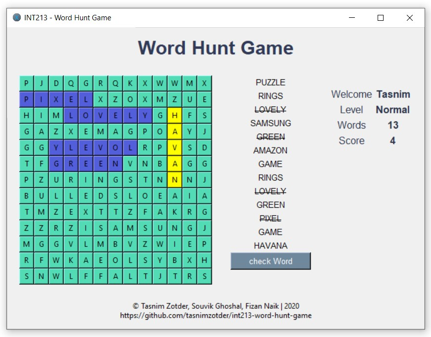
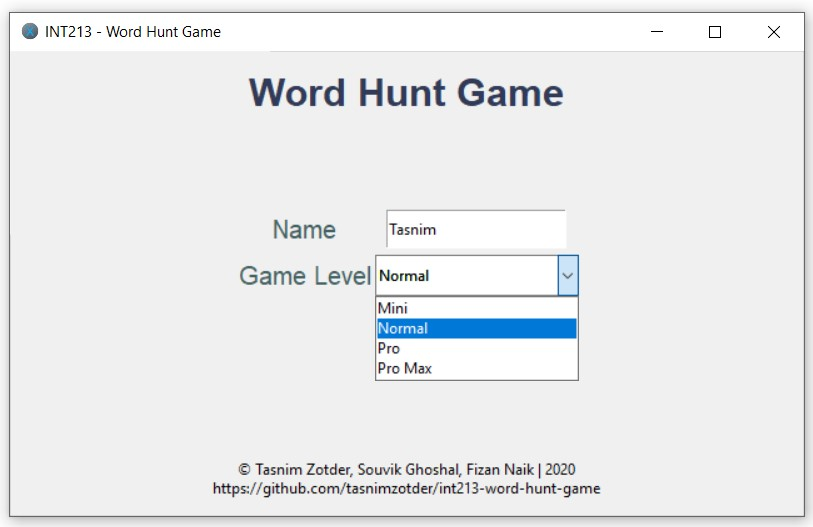

<p align="center">
    
    
    
    
    
</p>

# 🎮 INT213 - Word Hunt Game

### Let's hunt the lost words 🔍

## 🔤 Languages Used

<p align="center">
    
    
</p>

## ⚓ Requirements

| Name   | Version | Website                                      |
| ------ | ------- | -------------------------------------------- |
| Python | ^3.8    | https://www.python.org/                      |
| Poetry | ^1.14   | https://python-poetry.org/docs/#installation |

## 🎉 Getting Started

1. Clone (Download) the project

```bash
git clone https://github.com/tasnimzotder/int213-word-hunt-game.git
```

2. Run the program

a. Windows

```bash
./run.ps1
```

b. Linux

```bash
bash run.sh
```

## 🧑‍🤝‍🧑 Collaborators

<p align="center">
    <a href="https://github.com/tasnimzotder">
        
        &nbsp&nbsp&nbsp&nbsp
    </a>
    <a href="https://github.com/Souvik-Ghosal">
        
        &nbsp&nbsp&nbsp&nbsp
    </a>
    <a href="https://github.com/fizannaik">
        
        &nbsp&nbsp&nbsp&nbsp
    </a>
<p>

## 📷 Screenshots



## 📃 References

- **Poetry Docs**: [Poetry](https://python-poetry.org/)
- **YAML Docs**: [Stack Abuse](https://stackabuse.com/reading-and-writing-yaml-to-a-file-in-python/)
- **Tkinter GUI Docs**: [Real Python](https://realpython.com/python-gui-tkinter/)
- **Word Search Logic**: [PythonWordSearch](https://github.com/SpartanApple/PythonWordSearch)

## 📝 License

This project is licensed under [MIT License](LICENSE).

## 💡 For more details view [Wiki](https://github.com/tasnimzotder/int213-word-hunt-game/wiki)
